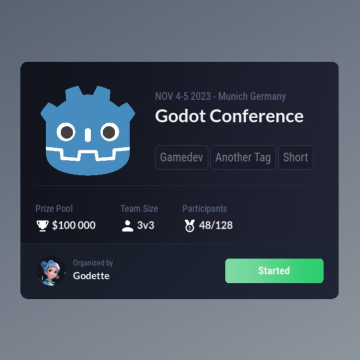
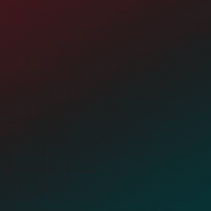
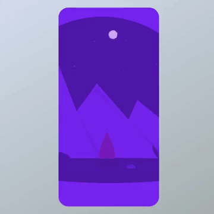
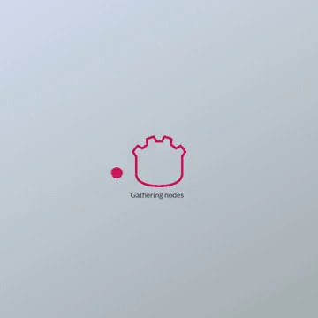
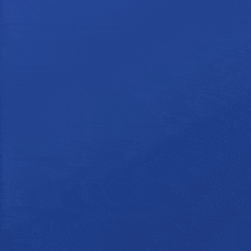
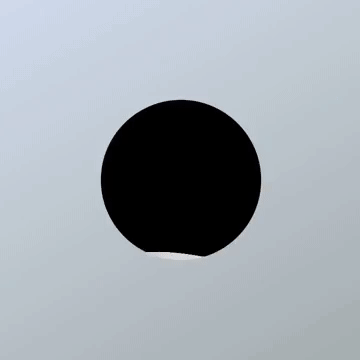
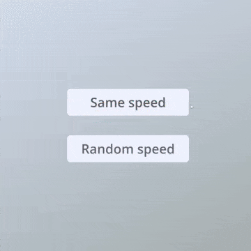
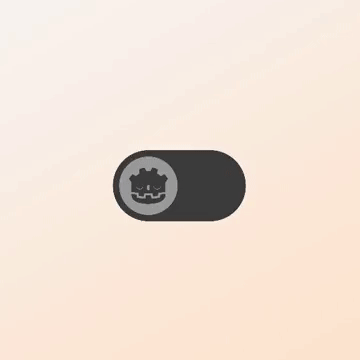
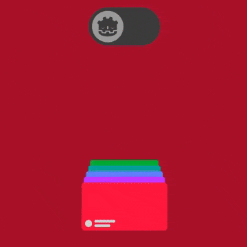
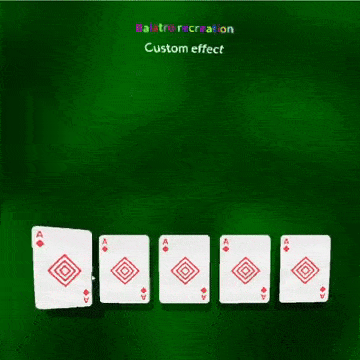

A collection of UI deisgns implemented in Godot 4 ✨

## 🎨 Components

    
    
    
    
    
    
    
    
    
    

## 📹 Videos

## 📔 Credits

- **esport_event**: [Design by Sok Studio](https://dribbble.com/shots/20302183-Nafes-eSport-Platform-Components)
- **level_up**: [Design by Koncepted](https://dribbble.com/shots/18340929-TIV-Rewards-Card-For-Gamers)
- **quiz**: [Design by RH](https://dribbble.com/shots/20053509-Quizlingo-Vocabulary-Game-App-UI)
- **level_up_again**: [Design by Layer Lab](https://dribbble.com/shots/16442191-GUI-PRO-Kit-Simple-Casual)

## 💁‍♂️ About me

- [Discord](https://discord.gg/83nFRPTP6t)
- [YouTube - Gamedev](https://www.youtube.com/c/MrEliptik)
- [YouTube - Godot related](https://www.youtube.com/@mrelipteach)
- [Twitter](https://twitter.com/mreliptik)
- [Instagram](https://www.instagram.com/mreliptik)
- [Itch.io](https://mreliptik.itch.io/)
- [All links](https://bento.me/mreliptik)

If you enjoyed this project and want to support me 👇

**Get exlusive content and access to my game's source code**

**One time donations**

